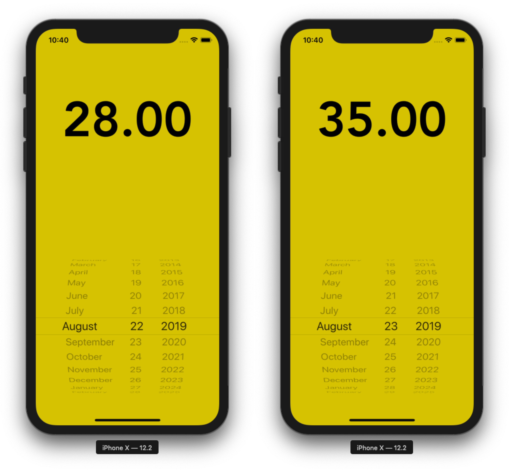

# Weather Prediction iOS Application
> Train, predict a weather prediction model

Prediting the daily max temperature for my Hometown Casablanca, Morocco.



## Train the model

MacOS, Linux & Windows:

```sh
python train.py
```

## Usage example

Download a large dataset of temperature from your hometown for example. (In this repo I used data For Casablanca, Morocco).

Clean up the data and add is to the API folder, make sure to use the columns name or you can change the script to fit your `csv` file.

Then you can call use the `train.py` to train the model and save it to the current directory.

Finally, you can predict the weather by running the Flask API or you can call the prediction function is `predict.py` file.

## Run the API
MacOS, Linux & Windows:

```sh
python app.py
```

## Meta

Omar MHAIMDAT – [Linkedin](https://www.linkedin.com/in/omarmhaimdat/) – omarmhaimdat@gmail.com

Distributed under the MIT license. See ``LICENSE`` for more information.

[Look at the rest of my repos](https://github.com/omarmhaimdat/)
